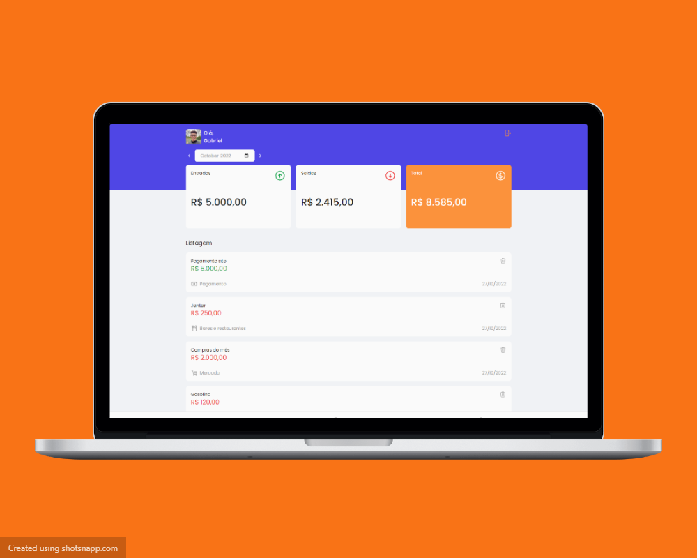

<h1 align="center">
    
    
Plutus

</h1>

<h1 align="center">
    
</h1>

<h2 align="center">Disponível em: https://plutus.gabrielnbds.dev </h2>

## 💻 Project

Plutus é a maneira mais simples de controlar suas finanças.

## 🚀 Techs

Projeto feito com:

- [Adonis](https://adonisjs.com/)
- [Tailwind](https://tailwindcss.com/)
- [Alpine](https://alpinejs.dev/)
- [TurboLinks](https://www.npmjs.com/package/turbolinks)

